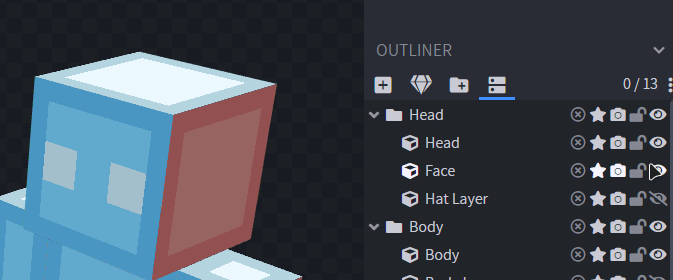
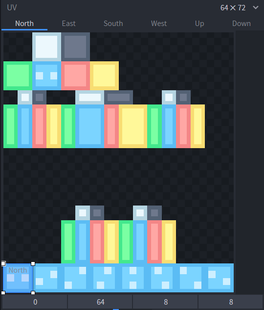
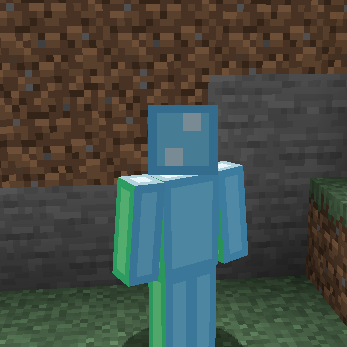
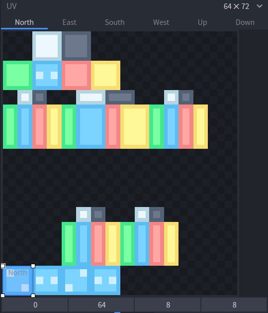
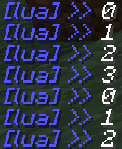
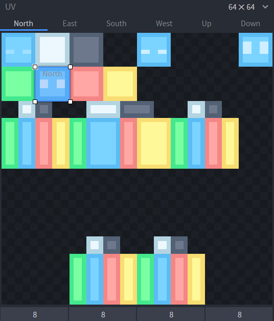
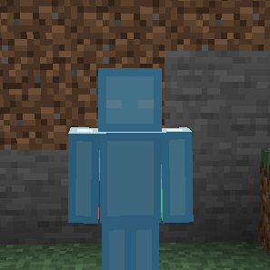
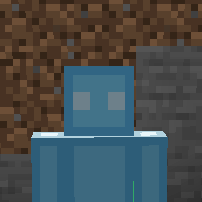

**THIS GUIDE IS FOR FIGURA ALPHA! WHILE THE PRINCIPLES STILL APPLY, THE EXAMPLE CODE WILL NOT WORK FOR BETA OR NEWER VERSIONS!**

Animating a texture in Figura works differently than in resource packs. Instead of a `.mcmeta` file, we use `CustomModelPart#setUV({u,v})` to change the texture coordinates a cube is using.

In this tutorial we are going to make a blinking animation. To make it a little easier I have gone ahead and seperated the face from the rest of the head. This is optional but makes things easier to demonstrate more clearly. (Duplicate the head cube, set the front face to transparent on the head, and all other faces to transparent on the face. Make sure to be in Per-Face-UV mode for this)



For the first part let's just use this dummy animation. To make it, I just expanded the default texture to make space at the bottom and drew a few frames. Set the UV box for the face to be the first frame.



To animate it, all we have to do is make a script that cycles through these. To do this, we can use `World#getTime()` and `CustomModelPart#setUV({u,v})`.

The `setUV` function shifts the UV box by a given amount. It will offset it relative to the default position we have given it in BlockBench, in this case the lower left corner. Since `setUV` takes a value fraction as input (1 means whole texture size, 0.5 means half of the texture size, etc..) we can just shift it 1/8 every step to make it go through all 8 frames.

```lua
function tick()
    local time = world.getTime()
    model.Head.Face.setUV({time/8,0})
end
```
We don't even have to clamp the time value in between 0 and 7 because `setUV` just cycles around the texture if the value overflows.



If you want to make the animation slower, we can divide the time by some value. Note that this will produce float values like 4.5 or something, so it wouldn't shift the full 1/8 step. To fix this we can floor it to the next integer.

```lua
function tick()
    local time = world.getTime()
    model.Head.Face.setUV({math.floor(time/2)/8,0})
end
```

Let's suppose you wanted to use less frames. To prevent the UV from scrolling through the entire texture, and instead only use 4 frames for example, we can use the modulo operator.



```lua
function tick()
    local time = world.getTime()
    model.Head.Face.setUV({(time % 4)/8,0})
end
```

If you try logging `time % 4` in chat you will see that it only ranges from 0 to 3 and then starts over again.



What if you have a really messy texture and no easy way to lay out your frames all next to each other tho? To demonstrate, I have resized the texture back to the normal 64x64 size and I placed my frames on unused spaces on the texture. I made a simple blinking animation.



This time we are going to use pixels measurements instead. To use a pixel value, divide by the texture size. For example, to shift my UV box to the top right corner from where it started, I would need to offset it by 8 pixels up and 48 pixels to the right. Since the V coordinate goes down, we use -8 pixels.

```lua
local width = 64
local height = 64
model.Head.Face.setUV({48/width,-8/height})
```

To manage the UV offsets we can create a table containing all the values, and then just cycle through them similar to what we did earlier.

```lua
frames = {
    {0,0},         -- open eyes
    {24/64,-8/64}, -- half closed eyes
    {-8/64,-8/64}, -- closed eys
    {48/64,-8/64}  -- wide open eyes
}

function tick()
    local time = world.getTime()
    model.Head.Face.setUV(frames[(time % 4) + 1])
end
```

As you can see, it is now playing the blinking animation.



To make it look pretty we can wait a bit until we restart the animation. For this its easier to make our own timer variable. (Note that my screen recorder seemingly didn't manage to get enough fps to record all frames so the gif might look like some are skipped.)

```lua
frames = {
    {0,0},         -- open eyes
    {24/64,-8/64}, -- half closed eyes
    {-8/64,-8/64}, -- closed eys
    {48/64,-8/64}  -- wide open eyes
}

time = 1
nextBlink = 0

function tick()
    if time > 4 then
        time = 1
        nextBlink = world.getTime() + math.random(15,50)
    end
    model.Head.Face.setUV(frames[time])
    if nextBlink < world.getTime() then
        time = time + 1
    end
end
```


