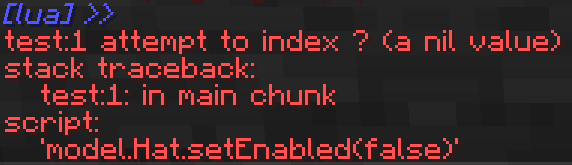
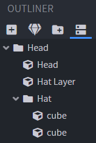
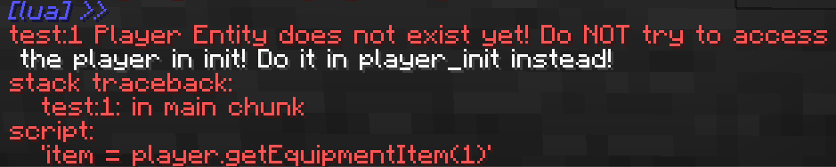
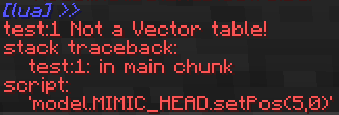
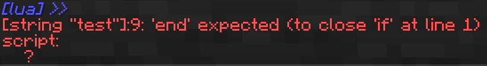
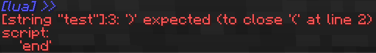

This list aims to help lua beginners understand error messages and learn how to fix them.

# attempt to index ? (a nil value)

This error happens if you try to put a dot `.` after a variable, to access something inside of it, which doesnt have a value (is nil).



A common mistake is to forget to save your blockbench model or don't use the correct path.



```lua
model.Hat.setEnabled(false) -- error
--        ^
--        Hat doesn't exist but you are trying to use setEnabled on it

model.Head.Hat.setEnabled(false) -- fixed
```

# Player Entity does not exist yet



If you try to use the `player` table in the init phase, you will get this error. To make sure the player exists when the line is executed, you simply have to put it inside the `player_init` function.

```lua
item = player.getEquipmentItem(1) -- error

-- fixed:
function player_init()
    item = player.getEquipmentItem(1) 
end
```

The `player_init` function is called one time when the script loads but Figura makes sure that the player entity has properly initialized and is now available to use.

# Not a Vector table!



Positions, rotations, colors, coordinates and more use vector tables to combine multiple values. If you get this error, you probably just forgot to put your values inside `{}` to make them part of a table.

```lua
model.MIMIC_HEAD.setPos(5,0) -- error

model.MIMIC_HEAD.setPos({5,0}) -- fixed
--                      ^   ^
```

# 'end' expected

In Lua you have to close code blocks using the `end` keyword. This applies to functions, if statements and loops. This can easily happen if you don't indent your code properly, because it's more difficult to tell which end goes with what beginning statement.



```lua
-- error:
if player.isGrounded() then
    log("On Ground")

-- fixed:
if player.isGrounded() then
    log("On Ground")
end
```

# ')' expected

Similar to end expected, this time you forgot to close a parenthesis you previously opened.



```lua
model.Body.setColor({0,1,1}  -- error

model.Body.setColor({0,1,1}) -- fixed
--                         ^
```
